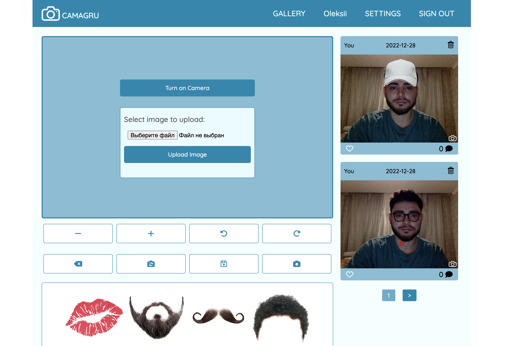
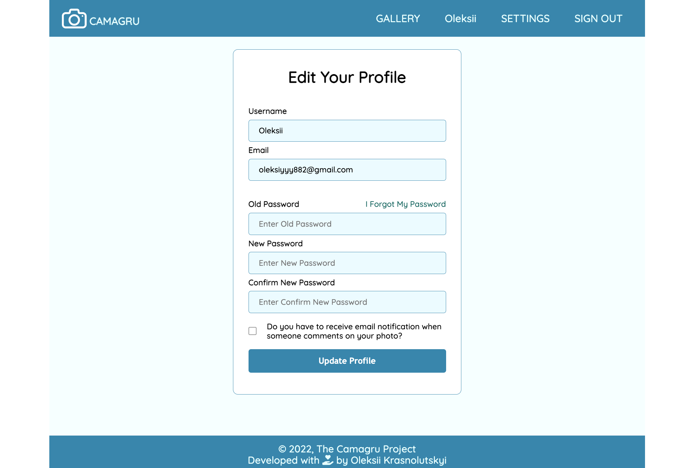

# A small Instagram-like site allowing users to create and share photo-montages
## Simply make photo :camera:, add funny effects :sparkles: and leave your footprint :feet: in history.

Camagru is the project developed on simple MVC pattern  **only with native PHP, JavaScript, CSS and HTML**.

The idea is to create a small web application where users can make basic photo editing using theirs webcams and some predefined images.

App's users can select effect images and add on yours photo.
There are different effect images such as glasses, mustache, beard and other. You have oportynity mixed different effec images on your photo, rotate, increase, decrease and cancel last effect if you changed you mind.

**Please find subject with full description :point_right: [here](camagru.en.pdf) :point_left:.**

## DESCRIPTION OF MY IMPLEMENTATION:

### The project is divided into :three: parts.

#### :one: Profile Page:

:large_orange_diamond:  get access to the camera (check it in different browsers);
 
:large_orange_diamond:  making photo;
 
:large_orange_diamond:  upload image from computer;
 
:large_orange_diamond:  add frames, effects or filters on captured photo or as preview on video stream;
 
:large_orange_diamond:  save edited image to a personal gallery (and of course - database :wink:);
 
:large_orange_diamond:  delete personal images.
 
#### :two: User Management:

:large_orange_diamond:  sign up;
 
:large_orange_diamond:  sign in;
 
:large_orange_diamond:  sign out;
 
:large_orange_diamond:  email confirmation;
 
:large_orange_diamond:  edit profile;
 
:large_orange_diamond:  change password;
 
:large_orange_diamond:  forgot password.
 
#### :three: Public Gallery:

:large_orange_diamond:  show all images from all users ordered by date of creation;
 
:large_orange_diamond:  allow like images;
 
:large_orange_diamond:  allow comment images;
 
:large_orange_diamond:  add pagination.

### Installation:
 - "composer install"
 - in the config/config.php file, add the MySQL connection settings
 - "php database/dbMySQL.php"

## USEFUL LINKS:

:large_blue_diamond:  [Tutorial how to take video stream from webcam and make photo](https://developer.mozilla.org/en-US/docs/Web/API/WebRTC_API/Taking_still_photos)

:large_blue_diamond:  [Tutorial how to edit img with JavaScript](https://developer.mozilla.org/en-US/docs/Web/API/Canvas_API/Tutorial/Using_images)

:large_blue_diamond:  [How to debug PHP tutorial](http://blog.teamtreehouse.com/how-to-debug-in-php)

:large_blue_diamond:  [PHP Form Validation And Verification](https://www.phpjabbers.com/php-validation-and-verification-php27.html)

:large_blue_diamond:  [Resolving PHP relative path problem](http://yagudaev.com/posts/resolving-php-relative-path-problem/)

:large_blue_diamond:  [Using AJAX in JS](https://developer.mozilla.org/ru/docs/Web/API/Fetch_API/Using_Fetch)

:large_blue_diamond:  [Safe Password Hashing](http://php.net/manual/en/faq.passwords.php)

## HOW TO CONTACT ME:

If you found mistake || bug || have any questions || suggestions, please feel free to contact me at
agalavan@student.unit.ua